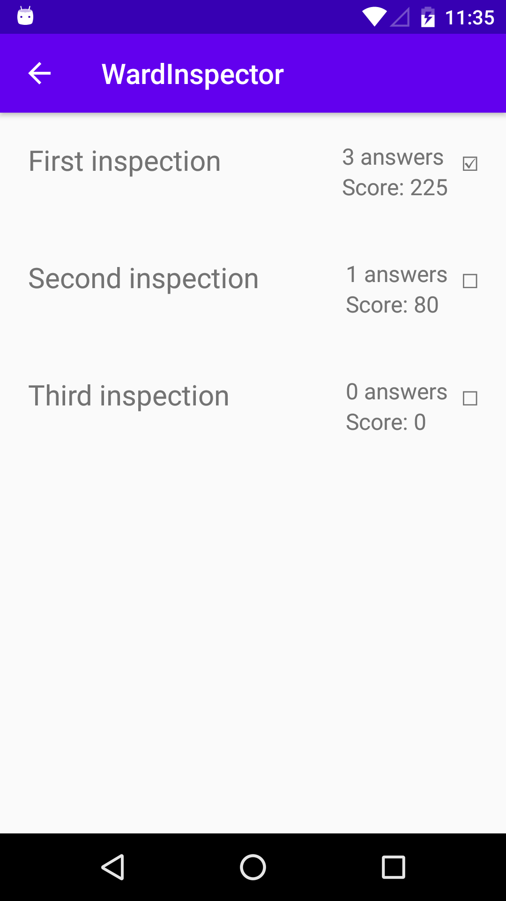
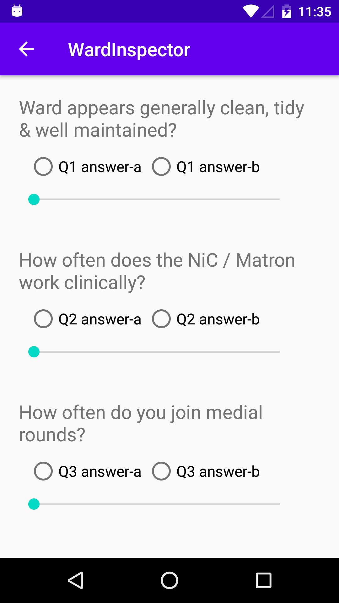

This is project is partially complete demonstration of the "ward inspection" task.

**Architecture**

- The app is written in Kotlin
- Room is used for database persistence
- RxJava is used for database queries, and also for some UI event handling
- It uses MVVM in principle but only a skeleton implementation exists
- Data is requested from a respository, but only a local source (i.e. database) exists
- A single-activity model is used, with Fragments for each screen. Navigation is done using the Navigation Component.
- RecyclerViews with Data Binding are used to present lists on the UI
- Timber used for logging

**Functionality**

Most of the work done is in the data layer. There are classes to represent Inspection, Question, Answer, and AnsweredQuestion. Each question can have many answers, and each inspection can have many answered questions.

It is envisaged that the Inspection, Questions and Answers tables would (presumably) be set up by syncing data with the server, but in this project this is simulated by populating example data into the database upon startup: three inspections (one of which is complete), three questions, and six answers (two answers per question). As a user completes an inspection, the data would be recorded in the AnsweredQuestions tables, which is a link table to join inspections with question and the answer score.

Two screens have been implemented: the first shows the current list of inspections, with how many questions have been answered in each. Clicking on a inspection goes to the second screen, the questions view. This shows all the available questions to be answered. For each question, the possible answers are shown as Radio Buttons, with a slider to set a value from 0-100.

**What is not included**

- The questions page is not updated or persisted with new data.
- There is no implementation of Inspection "types"
- There is no login flow
- Completed inspections cannot be submitted.

**Screenshots**

